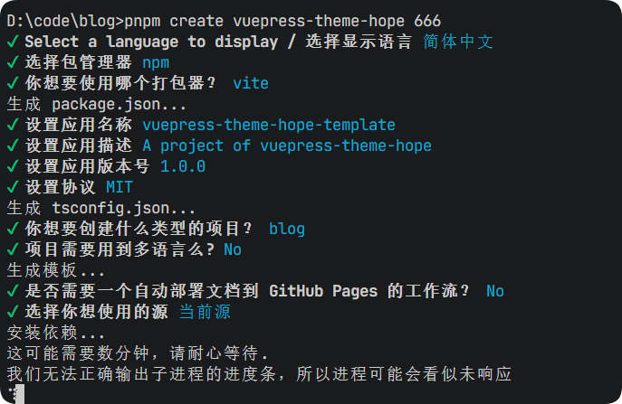

# 关于本bolg的制作
## 参照
- 本博客的创建，主要基于 [Hope Theme](https://theme-hope.vuejs.press/zh/) 主题，主题的配置文件可以在 [这里](https://theme-hope.vuejs.press/zh/config/) 找到。
- 参考了[juejin的文章](https://juejin.cn/post/7258533971963822140)

## 制作流程(步骤)
1. 创建项目
   - 使用`pnpm create vuepress-theme-hope hope-project` 命令可以生成一个blog项目模板
   - 生成时会询问几个问题,具体如图
       -  可根据具体需求修改
   - 创建项目后，进入项目目录，使用`npm i` 安装依赖
   - 安装完成后，使用`npm run docs:dev` 启动项目
   - 项目启动后，在浏览器中打开`http://localhost:8080` 即可查看项目
2. 修改内容
   - 观察项目结构,主要修改的文件有
      - `src/README.md` 首页的内容
      - `src/intro.md` 个人介绍
      - `src/.vuepress/public` 项目的静态资源目录
      - `src/posts` 项目的文章目录